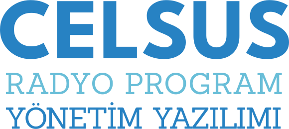

<table>
<body>
<tr>
    <td style="width:100px; valign: middle; margin-right: 1rem;"></td>
    <td style="valign-middle"></td>
</tr>
</body>
</table>

# Celsus Radyo Program Yönetim Yazılımı Belgelemesi

**Dil**: Türkçe  
**Son güncellenme:** 2024-04-03 | JMW

!! Bu uygulama hâlâ geliştirilme aşamasındadır !!

Celsus Radyo Program Yönetim Yazılımı, birçok farklı dilde birden fazla radyo istasyonu için radyo programlarını ve ilgili podcastleri yönetmek ve takip etmek için merkezi bir yazılım altyapısını sağlar sağlar. Celsus RPYY, çok dilli olmak üzere tasarlanmıştır ve bağımsız olarak veya WordPress veya Drupal çalıştıran uzak sunucularla tam entegrasyon içinde kullanılabilir.

Celsus RPYY'nın © Telif Hakları Hawke AI ve JS Prodüksiyon Ltd. Şti.'ne aittir. Tüm Hakları Saklıdır. 

Yazılım kısmen açık kaynak kodludur. Kodu incelemek isteyenlerdev@hawke-ai.com veya yazilim@jsproduksiyon.com adreslerine gönderilen yazılı talep gönderebilir. Celsus RPYY'nın kullanımı özel bir lisansa tabidir. Tüm özelliklerin sınırlı bir kapasitede işlevsel olduğu bir deneme sürümü ücretsiz olarak kullanılabilir. Tüm özelliklerin kullanımı için bir lisans satın alınması gerekir.

## Modüller
- Celsus Radyo Program Yönetim Yazılımı
- Celsus Veri Kanalı
- Celsus WordPress Veri Sunum Eklentisi
- Celsus Drupal Veri Sunum Mödülü

## Mevcut Diller
- [Almanca (Deutsch)](README-de.md)
- [İngilizce (English)](README.md)
- Türkçe
